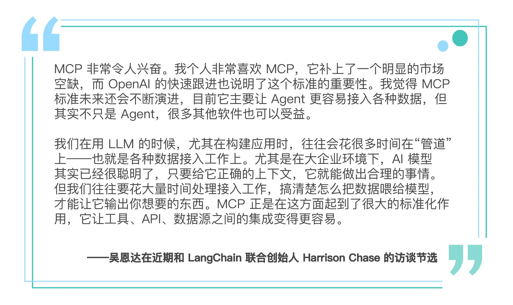
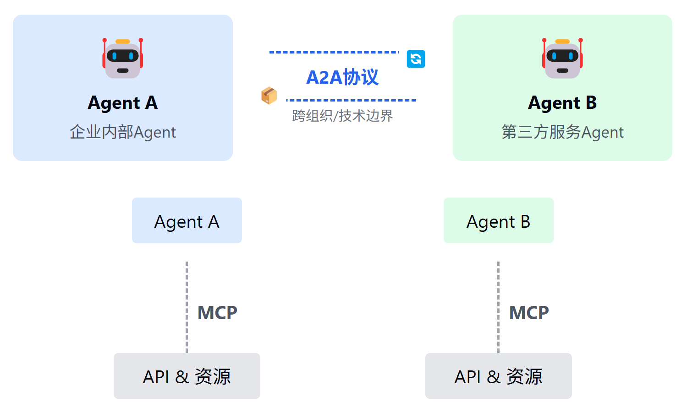
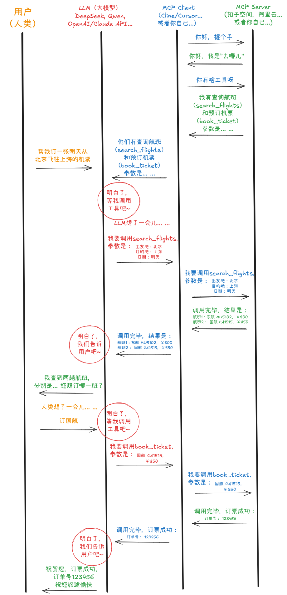

# 极客时间专栏学习之旅

[👉 点击进入专栏介绍页](https://time.geekbang.org/column/intro/101053801)

---

本专栏自上线两周以来，已有近3000位同学加入学习之旅。欢迎你一同开启知识探索之门！

---

---

## 什么是 MCP 协议？

MCP（Multi-Channel Protocol，多通道协议）是一种面向 AI Agent 的通用通信协议，旨在实现多种智能体之间的高效协作与资源共享。MCP协议支持多种数据类型、工具调用、资源发现等能力，是现代智能体系统的基础通信桥梁。

MCP协议的核心特性包括：
- 支持多种通信通道（如标准输入输出、网络等）
- 统一的消息格式，便于扩展
- 丰富的工具调用与资源发现机制

---

## 专栏简介

本专栏以MCP协议为核心，带你从零实践AI Agent的通信、工具调用、资源发现、提示模板等关键能力。内容涵盖：
- MCP协议原理与实现
- 典型AI Agent通信场景
- 工具链与资源管理
- 提示模板与智能体协作

通过理论结合大量实战代码，帮助你快速掌握AI Agent开发的核心技能。

---

欢迎关注专栏，开启你的AI Agent开发之旅！ 